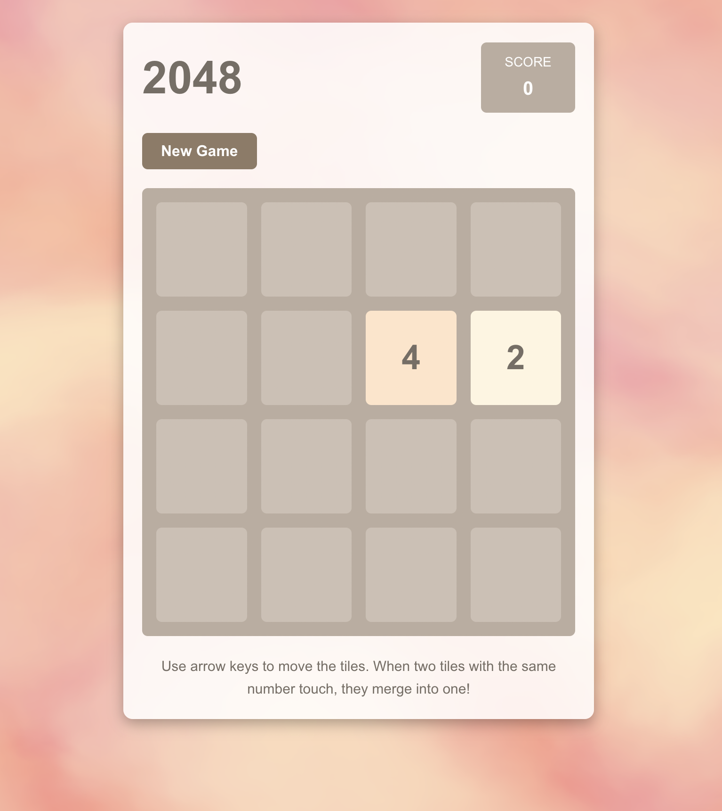

# 2048 Game - Vue.js Implementation

A modern implementation of the classic 2048 puzzle game built with Vue 3 and Vite. Features smooth animations, responsive design, and a beautiful background effect using VantaJS.



## About the Game

2048 is a single-player sliding block puzzle game designed by Italian web developer Gabriele Cirulli. The game's objective is to slide numbered tiles on a grid to combine them and create a tile with the number 2048. The game continues beyond this point, allowing for higher-numbered tiles and higher scores.

## Game Features

- Sleek, responsive user interface
- Touch/swipe support for mobile play
- Keyboard controls (arrow keys)
- Score tracking with best score saved locally
- Beautiful animated background using VantaJS fog effect
- Responsive design for desktop and mobile devices

## Project Structure

```
├── public/            # Static assets
│   └── favicon.ico    # Site favicon
├── src/               # Source code
│   ├── assets/        # Styles and images
│   │   ├── base.css   # Base styles
│   │   ├── main.css   # Main styles
│   │   └── logo.svg   # Vue logo
│   ├── components/    # Vue components
│   │   ├── Game2048.vue     # Main game component
│   │   └── ...        # Other Vue components
│   ├── App.vue        # Root Vue component
│   └── main.js        # Application entry point
├── index.html         # HTML entry point
├── vite.config.js     # Vite configuration
├── package.json       # Project dependencies
└── README.md          # Project documentation
```

## How to Play

1. **Goal**: Combine tiles to create a tile with the number 2048
2. **Controls**:
   - **Desktop**: Use arrow keys (↑, ↓, ←, →) to move tiles
   - **Mobile**: Swipe up, down, left, or right to move tiles
3. **Gameplay**:
   - Tiles slide in the direction you choose
   - When two tiles with the same number touch, they merge into one tile with the sum of their values
   - After each move, a new tile (2 or 4) appears in a random empty spot
   - Game ends when there are no empty cells and no possible merges

## Getting Started

### Prerequisites

- Node.js (v14 or later)
- npm or yarn

### Running Locally

1. Clone the repository:
   ```sh
   git clone https://github.com/yourusername/2048-game-vue.git
   cd 2048-game-vue
   ```

2. Install dependencies:
   ```sh
   npm install
   ```

3. Start the development server:
   ```sh
   npm run dev
   ```

4. Open your browser and navigate to:
   ```
   http://localhost:5173
   ```

### Building for Production

```sh
npm run build
```

The built files will be in the `dist` directory, ready to be deployed to any static hosting service.

## Technologies Used

- **Vue 3**: Progressive JavaScript framework
- **Vite**: Next-generation frontend tooling
- **VantaJS**: 3D animated backgrounds
- **Three.js**: JavaScript 3D library (used by VantaJS)

## License

This project is open source and available under the MIT License.

